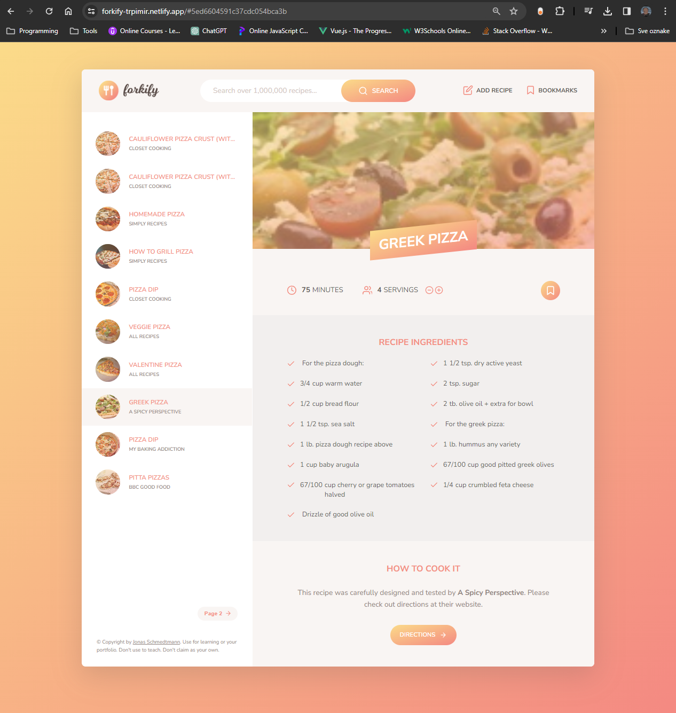

# Forkify Recipe Application

Forkify is a recipe application built with JavaScript, HTML, and CSS. It allows users to search for recipes, view recipe details, adjust servings, and add ingredients to a shopping list. This project was inspired by [The Complete JavaScript Course](https://www.udemy.com/course/the-complete-javascript-course/) on Udemy, particularly the Forkify section.

## Features

- **Search**: Search for recipes using keywords or ingredients.
- **View Details**: View detailed information about a recipe, including ingredients and cooking instructions.
- **Adjust Servings**: Easily adjust the number of servings and see the ingredients list update accordingly.
- **Responsive Design**: The application is designed to work well on desktop and mobile devices.

## Installation

To run the Forkify app locally, follow these steps:

1. Clone this repository to your local machine using `git clone https://github.com/TrpimirTomasic9/Forkify-app`
2. Navigate to the project directory: `cd forkify`
3. Open the `index.html` file in your web browser.

## Usage

1. Enter a keyword in the search bar and press Enter.
2. Click on a recipe to view its details.
3. Adjust the number of servings using the provided controls.
4. Click on the bookmark icon to add recipe to your bookmark list.
5. Enjoy cooking your favorite recipes!

## Credits

- Forkify was built as part of [The Complete JavaScript Course](https://www.udemy.com/course/the-complete-javascript-course/) on Udemy by Jonas Schmedtmann.
- Recipe data is fetched from the [Food2Fork API](https://forkify-api.herokuapp.com/api/v2/recipes/).

## Author

[Trpimir Tomašić](https://github.com/TrpimirTomasic9)

Feel free to fork this repository and customize it to your liking!
